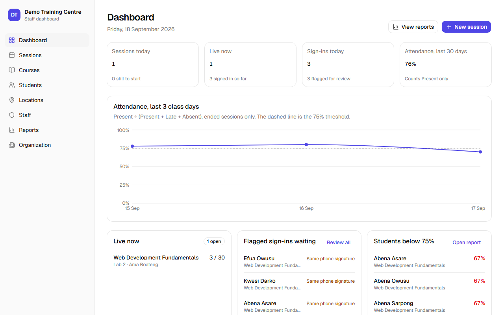
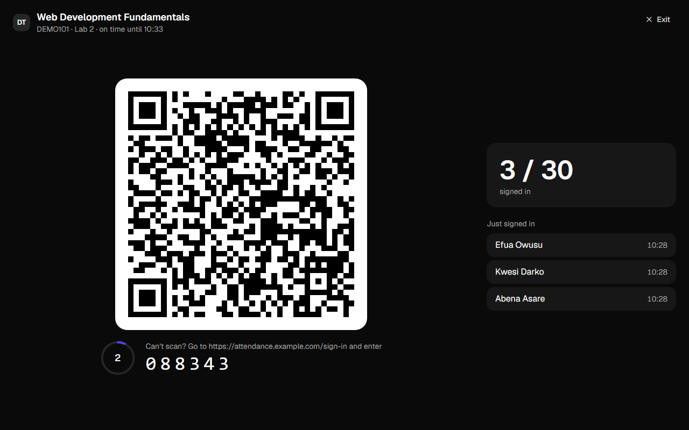
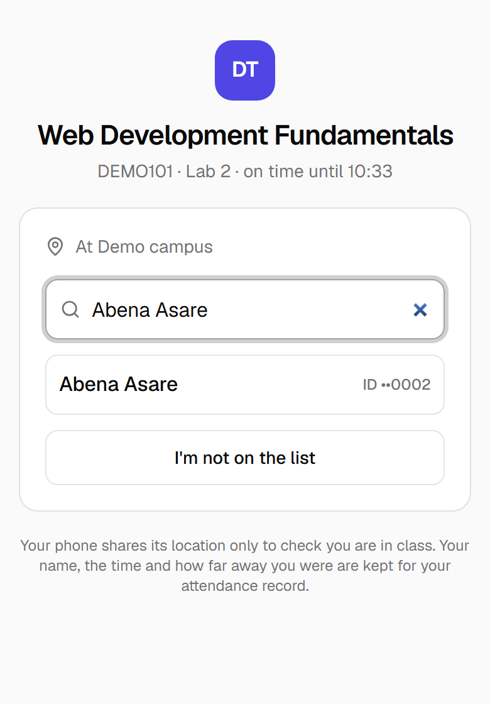
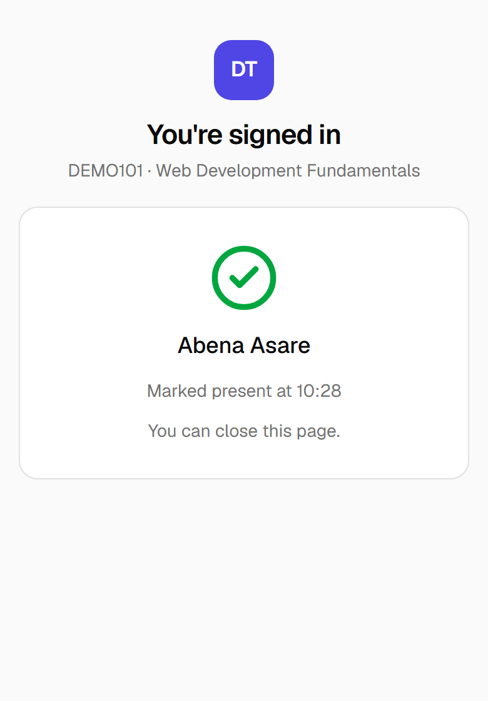
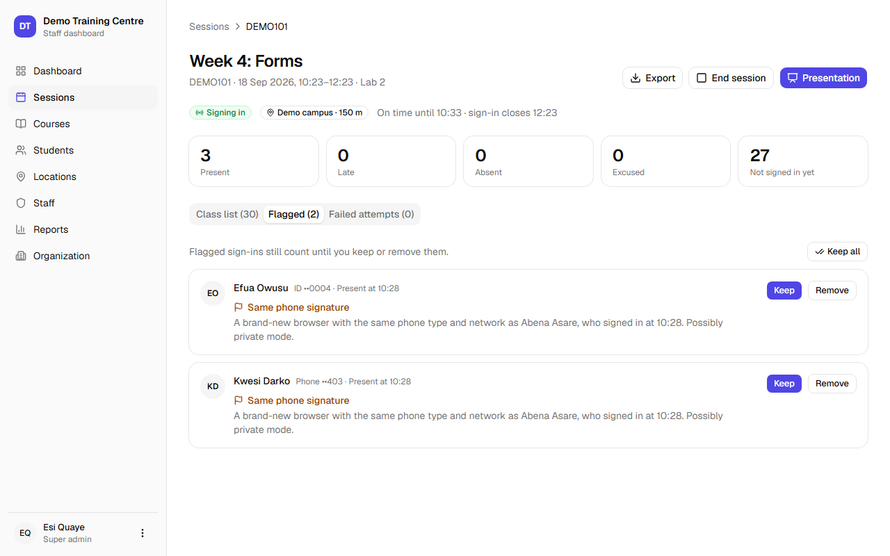
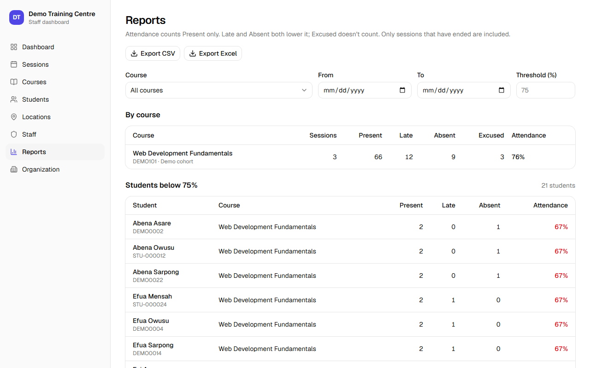
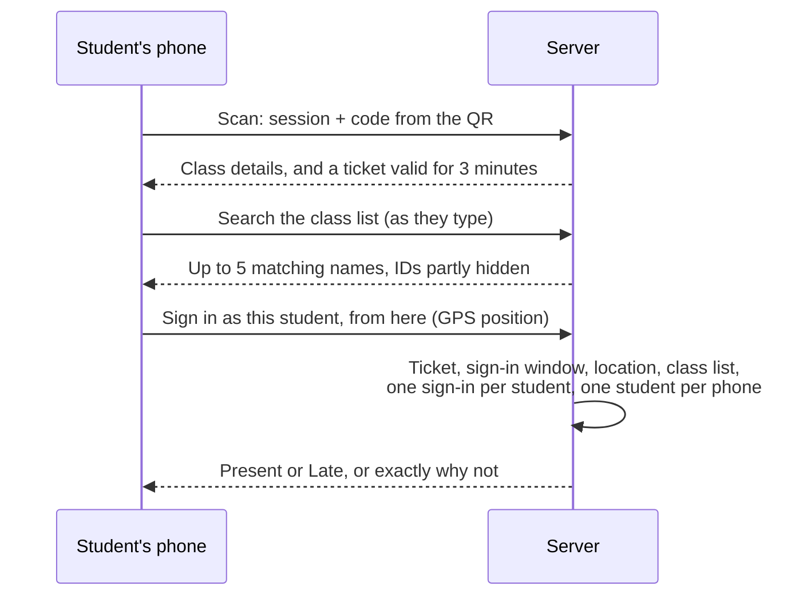
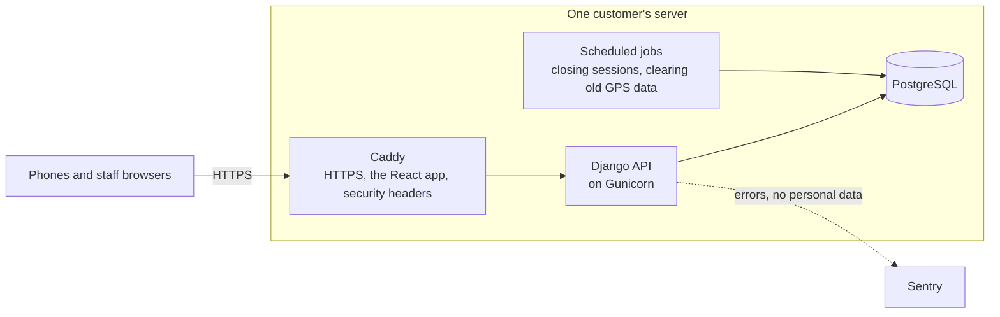

# QR Attend

**Attendance for schools and training centres, taken with a QR code and the students' own phones.**

A lecturer puts a QR code on the projector. Students scan it with their phone's camera, find their name and tap it, and they're marked present or late. A sign-in only counts from inside the class location, during the class, once per student and once per phone. No app to install and no student accounts.

I designed and built QR Attend end to end: requirements, design, backend, frontend, tests, packaging and documentation. Version 1.0 was released in September 2026. The source code is private. This repository shows what the product does and how it's built.

## What it does

| In class | On a student's phone |
|---|---|
|  |   |

- **For students:** scan, allow location, tap your name. A returning phone offers your name straight away. There's a 6-digit code for phones that can't scan, and clear screens explaining every refusal.
- **For lecturers:** courses and class lists imported from Excel, sessions with a location and a sign-in window, a full-screen presentation mode, and a review of anything suspicious after class.
- **For admins:** staff and roles, locations on a map, reports with CSV and Excel export, organization settings and an audit log of every change.
- **For each customer:** their own installation, name, logo, colour, time zone and locations. Nothing about one customer is built into the software.

| After class: reviewing flagged sign-ins | Reports |
|---|---|
|  |  |

## How a sign-in works

## Engineering highlights

**A code that can't be shared.** The QR code changes every 30 seconds. It's an HMAC of the session and the current time window, so the server checks it without storing anything, and a photo sent to a friend at home soon stops working. Scanning swaps it for a signed ticket that lasts three minutes, so the code can change while a student finds their name.

**Scan once, enforced by the database.** One sign-in per student per session and one student per phone per session are unique constraints in PostgreSQL, not just checks in code, so two taps in the same millisecond can't make two records. Phones are recognised by a device ID the server signs, kept in a cookie with a backup copy in the browser. A made-up ID is simply ignored.

**Location, honestly.** A sign-in counts inside the location's radius, plus the phone's own reported accuracy up to a limit. Sessions copy their location when they start, so moving a location later never rewrites a class that has already happened. Exact positions are deleted after a retention period; only the distance is kept.

**Flag, don't block.** No website can prove who is holding a phone, so things that look like a workaround are flagged for the lecturer instead of refused. That includes a brand-new browser identical to another phone on the same network, a phone that signed in someone else last time, or a student who added themselves. Each flag records its evidence at the moment it happened.

**Imports without duplicates.** Students are recognised by student ID, then email, then phone number. An import shows a preview of new, matched, possibly duplicated and conflicting rows, and never overwrites an existing student.

## Quality

| | |
|---|---|
| Automated tests | 451: 360 backend, 80 frontend, 11 end-to-end |
| Backend coverage | 95%, and over 90% everywhere a mistake costs a student their attendance |
| End-to-end | Playwright runs a whole installation from an empty database: setup, a lecturer, an imported class, a live session, and phone-sized browsers with real GPS positions signing in, being refused 2 km away, and reusing a phone |
| Security | A test calls every API route as an anonymous caller, so a new endpoint without permissions fails the build. Django's deployment checks run against the production settings, and a Content-Security-Policy is enforced and tested |
| Load | 300 students signing in from one Wi-Fi network in two minutes: 95% of requests answered in 174 ms, and no honest request rate-limited |
| Every pull request | Builds the Docker images, installs them the way a customer's server would, runs the whole journey against that installation, then backs it up and restores it |

The load test earned its place. Its first run showed a whole class being locked out: phones signing in for the first time were counted by their shared network address, so the first ten students used up everyone's allowance. That was fixed before any customer saw it, along with server errors that left nothing in the logs.

## Built with

| Part | Technology |
|---|---|
| Backend | Python 3.14, Django 6.1, Django REST Framework, PostgreSQL 18 |
| Frontend | React 19, Vite, React Router, TanStack Query, Tailwind CSS, shadcn/ui, Leaflet, Recharts |
| Testing | pytest, Vitest, Testing Library, MSW, Playwright, k6 |
| Delivery | Docker, Caddy (automatic HTTPS), Gunicorn, GitHub Actions, GitHub Container Registry |

## Architecture

Each customer runs their own installation from the same two Docker images, set up from a settings file and a first-run setup screen. A version tag publishes new images and a release; upgrading an installation is changing one setting and restarting. Nightly backups are copied off the server, and restoring one is tested on every pull request.

The project was run as a small software development life cycle, with requirements, a design, architecture decision records, a test plan with results, deployment and maintenance runbooks, and user guides for lecturers and admins.

## Contact

QR Attend is available to schools and training centres. To ask about using it, or to see the code as part of a job application, message me on [LinkedIn](https://www.linkedin.com/in/stephen-ohemeng-arhin).

---

Copyright © 2026 Stephen Ohemeng-Arhin. All rights reserved. See [LICENSE](LICENSE).
